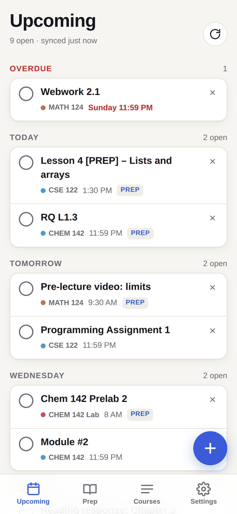
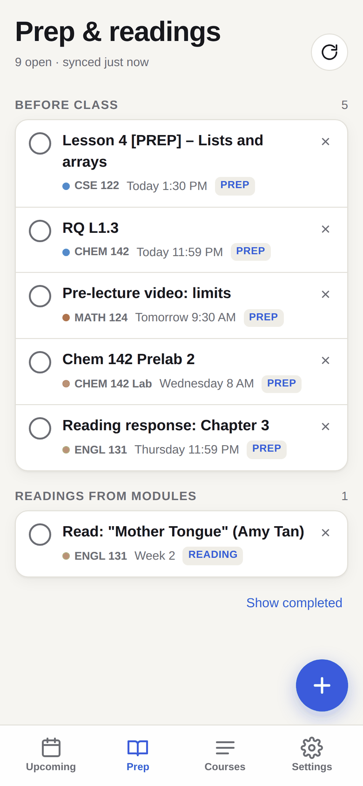
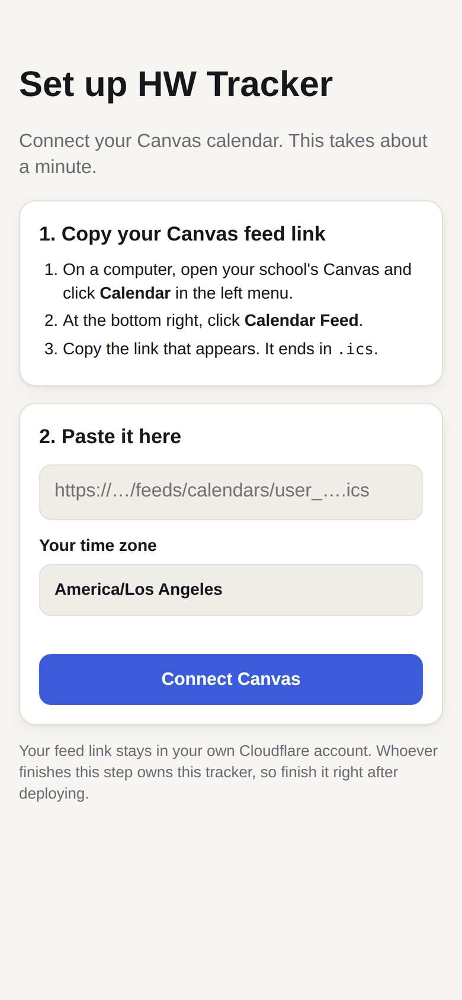

# HW Tracker for Canvas

All your Canvas homework, pre-class prep, and exams in one app on your phone, with reminders before things are due.

- **Upcoming:** everything due, grouped by day, with overdue work at the top
- **Prep:** pre-class lessons, reading quizzes, prelabs, and module readings in their own list
- **Courses:** what's open in each class
- **Reminders:** a push notification 3 hours before anything unfinished is due, plus an 8pm "due by end of tomorrow" digest
- **Your own tasks:** add readings or to-dos your professor only mentions in lecture

It works with any school that uses Canvas. You don't need a Canvas API token, so it works even if your school has those turned off. It runs free on your own Cloudflare account, so your data never goes through anyone else's server.

<p align="center">
  
  
  
</p>

## Set it up (about 5 minutes, no coding)

You need a free [Cloudflare account](https://dash.cloudflare.com/sign-up) and a free [GitHub account](https://github.com/signup).

### 1. Deploy your own copy

[](https://deploy.workers.cloudflare.com/?url=https://github.com/ishaanmakam/canvas-hw-tracker)

Click the button, sign in to Cloudflare and GitHub when it asks, and click **Create and deploy**. Cloudflare copies this project into your GitHub, creates the storage the app needs, and gives you a link like `https://canvas-hw-tracker.yourname.workers.dev`.

If Cloudflare asks you to choose a `workers.dev` subdomain, pick any name. It becomes part of your link.

### 2. Connect Canvas

Open your new link on a computer. It shows a setup page.

1. In another tab, open your school's Canvas and click **Calendar** in the left menu.
2. At the bottom right of the calendar, click **Calendar Feed** and copy the link. It ends in `.ics`.
3. Paste it into the setup page, check that your time zone is right, and click **Connect Canvas**.

Do this right after deploying. Whoever finishes setup first owns that tracker, and after that it's locked.

### 3. Put it on your iPhone

1. The setup page shows a QR code. Scan it with your iPhone camera. Your tracker opens in Safari, already signed in.
2. Tap **Share**, then **Add to Home Screen**.
3. Open **HW** from your home screen, go to **Settings**, tap **Turn on notifications**, then **Send test**.

iPhones only allow notifications from web apps that are on the home screen, and need iOS 16.4 or newer. On Android, open the link in Chrome and choose **Install app**.

The setup page also shows your **app key**. Save it in your password manager. You only need it if a device ever gets signed out.

### 4. (Optional) The Sync bookmark

The calendar feed tells the app what's due but not what you've already turned in. The Sync bookmark fills that in, and it also pulls readings from your courses' Modules pages.

1. In the app, open **Settings** and tap **Copy bookmark code**.
2. In Safari, bookmark any page and name it **Sync HW**.
3. Edit that bookmark and replace its address with the code you copied.
4. While you're on Canvas, open your bookmarks and tap **Sync HW**. A banner confirms the sync.

Run it whenever you want submitted work checked off. Without it, you can still tick items off by hand.

## Questions

**Is my Canvas data private?**
Your feed link and assignments are stored only in your own Cloudflare account. Treat your Calendar Feed link like a password, since anyone who has it can see your assignment list. The same goes for the tracker's QR code and sign-in link.

**What does it cost?**
Nothing for one person. It fits well inside Cloudflare's free Workers plan.

**How often does it update?**
Every 30 minutes on its own. You can also tap the refresh arrow at any time.

**Something is tagged wrong (Prep vs. homework vs. exam).**
The tags come from assignment names. Edit the patterns at the top of `src/model.js` in your copy of the project to match how your professors name things.

**I switched schools or my feed stopped working.**
Go to Settings, then Canvas feed, paste a new Calendar Feed link, and save.

**How do I start over completely?**
In the Cloudflare dashboard, open Workers & Pages, then your tracker, then its KV storage, and delete the `config` key. The next visit shows the setup page again.

## Known limits

- Work outside Canvas, such as completion on Ed, Gradescope, or WebAssign, isn't visible. If the assignment is listed in Canvas it still shows up with its due date, but you tick it off yourself.
- Module readings appear only when a professor posts them as Canvas module pages or files with a completion requirement.
- Without the Sync bookmark, the app doesn't know what you've submitted, so reminders can fire for work you already turned in.

## Getting updates

Your copy lives in your own GitHub. To pick up new versions, open your copy on GitHub and click **Sync fork** (or merge from `ishaanmakam/canvas-hw-tracker`). If you deployed with the button, Cloudflare redeploys on its own when your copy changes.

## For developers

```bash
git clone https://github.com/ishaanmakam/canvas-hw-tracker.git
cd canvas-hw-tracker
npm install
npm run deploy        # logs you in to Cloudflare, creates the KV storage, deploys
npm test              # parser, merge and push-encryption tests
npm run dev           # local server at http://localhost:8787
```

How it fits together:

```
Canvas calendar feed ──(every 30 min)──▶ Worker ──▶ KV storage ◀── web app (installable PWA)
Sync bookmark on Canvas ──(POST /api/sync)──▶ Worker
Worker cron ──(Web Push: VAPID + aes128gcm)──▶ Apple / Google push ──▶ your phone
```

| File | What it does |
| --- | --- |
| `src/index.js` | API, first-run setup, sign-in, the 30-minute cron, reminders and digest |
| `src/model.js` | Calendar feed parsing (with time zones), Canvas planner mapping, merging |
| `src/push.js` | Web Push encryption and signing with WebCrypto, no dependencies |
| `public/` | The app: HTML, CSS, JS, service worker, icons, vendored QR code generator |

Reminder timing is set by `DIGEST_HOUR` and `REMIND_BEFORE_MS` at the top of `src/index.js`.

Settings live in KV under `config`. Older installs that set `APP_KEY`, `CANVAS_ICS_URL` and `VAPID_*` as Worker secrets keep working, because secrets take priority over KV.

## License

MIT. See [LICENSE](LICENSE). The bundled QR code generator (`public/vendor/qrcode.js`) is MIT, © Kazuhiko Arase.

Not affiliated with Instructure or Canvas.
